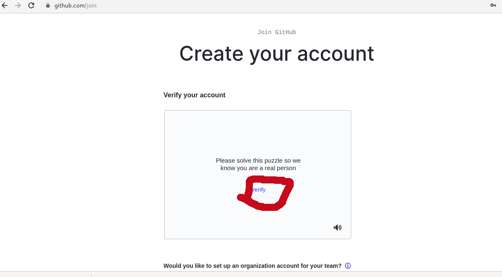
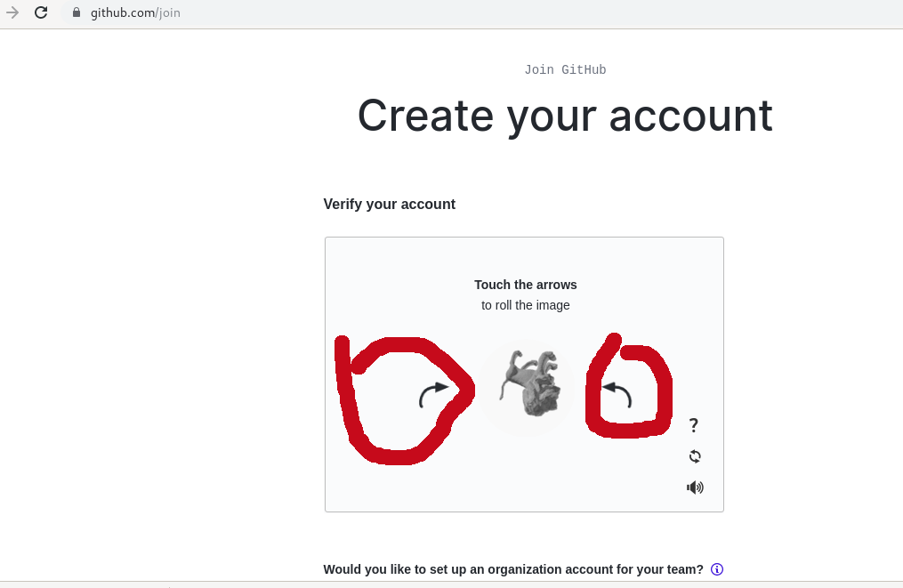
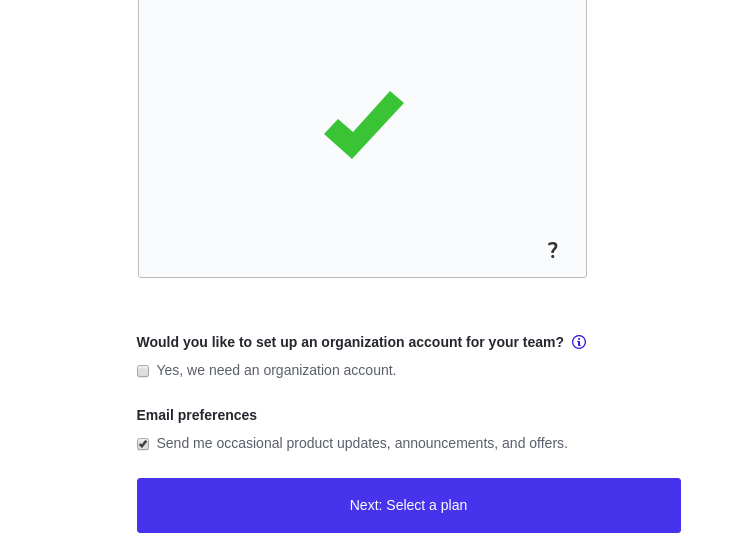
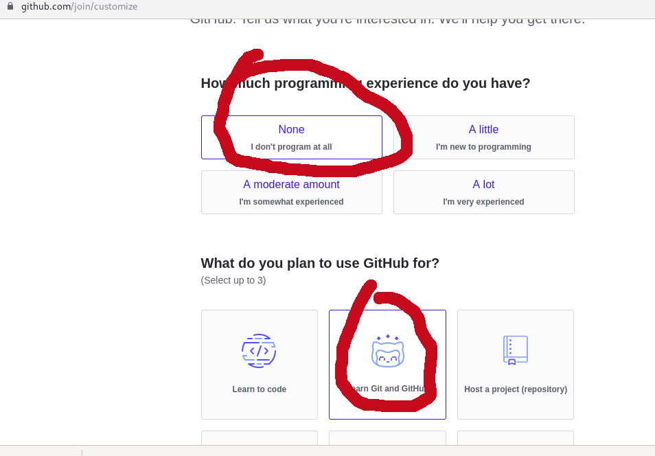
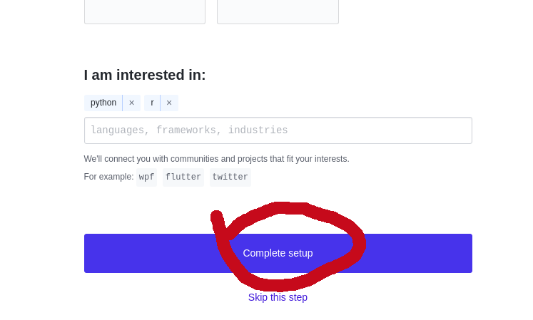
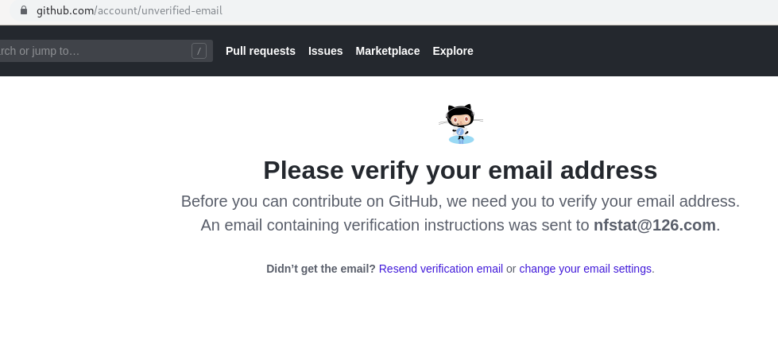
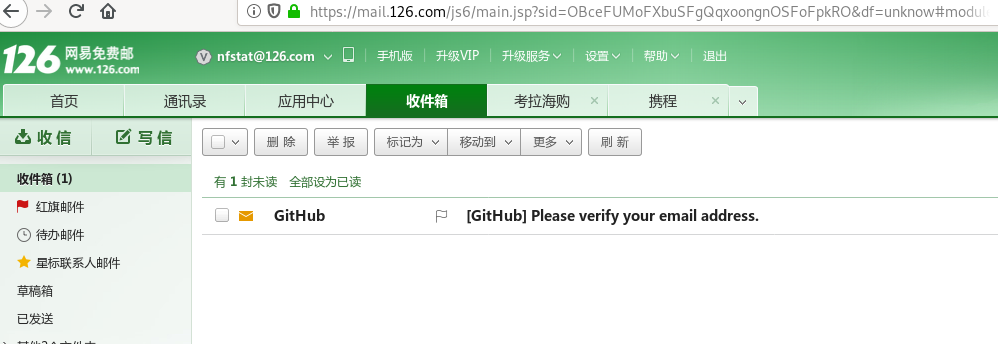
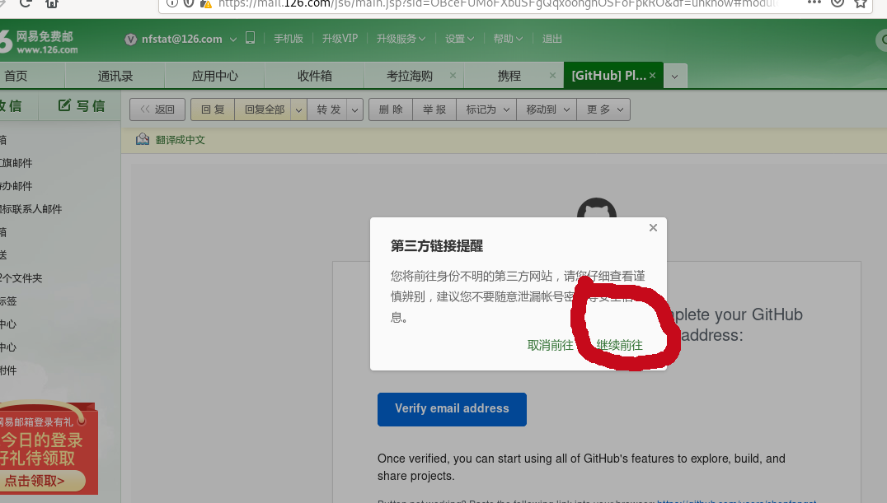
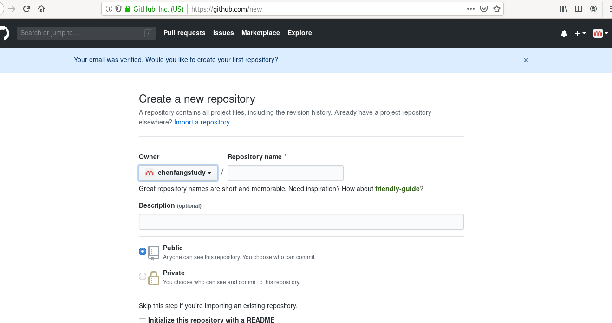

# 注册github账号过程详解

在接下来的学习过程中，我们将一起来熟悉github，如果大家有兴趣还可以认真去学习争取能玩转github

## 打开http://github.com 开始注册

1. 给自己起个名字
2. 用一个邮箱（注意一定是常用的）
3. 设置密码，注意要符合标准

        

## 回答问题并注册

1. 点击verify按钮
2. 旋转按钮让图形放到正确的位置上（这一步主要防止恶意注册）
具体参见图像

##  回答完问题之后还要完成下面一些问题(这一步是必须的)

## 为了调查用户的水平，github还要你完成一定的问题

你可以仿照我的下面图片来填

    

##  进入你的邮箱完成最后的验证

